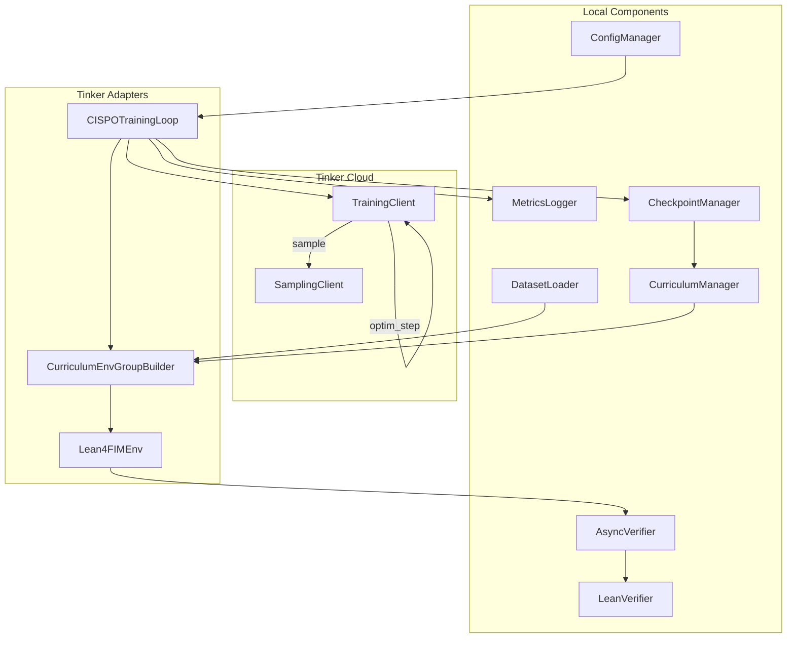

# Design Document: Tinker API Integration

## Overview

This design document describes the integration of Tinker API into the Lean4 FIM + RLVR project. The integration replaces the current Unsloth + TRL GRPO training infrastructure with Tinker's cloud-based API, enabling cost-effective training of large MoE models (particularly `gpt-oss-120b`) using CISPO (Clipped Importance Sampling Policy Optimization).

The architecture preserves existing components (LeanVerifier, CurriculumManager, masking utilities) while adapting them to work with Tinker's `Env` interface and training primitives (`forward_backward()`, `optim_step()`, `sample()`).

## Architecture



## Components and Interfaces

### 1. Lean4FIMEnv (Tinker Environment Adapter)

Implements Tinker's `Env` interface to wrap Lean4 verification as an RL environment.

```python
from dataclasses import dataclass
from typing import Optional, List
import asyncio

@dataclass
class Observation:
    """Tokenized observation for the model."""
    tokens: List[int]
    
@dataclass
class StopCondition:
    """Defines when to stop generation."""
    max_tokens: int = 512
    stop_strings: Optional[List[str]] = None

@dataclass  
class StepResult:
    """Result of taking an action in the environment."""
    reward: float
    episode_done: bool
    next_observation: Optional[Observation]
    next_stop_condition: Optional[StopCondition]


class Lean4FIMEnv:
    """
    RL Environment for Lean4 proof infilling.
    Implements Tinker's Env interface.
    """
    
    def __init__(
        self,
        prefix: str,
        suffix: str,
        ground_truth_middle: str,
        tokenizer,
        verifier: "AsyncVerifier",
        max_tokens: int = 512,
        prompt_formatter: "FIMPromptFormatter" = None,
    ):
        self.prefix = prefix
        self.suffix = suffix
        self.ground_truth = ground_truth_middle
        self.tokenizer = tokenizer
        self.verifier = verifier
        self.max_tokens = max_tokens
        self.formatter = prompt_formatter or FIMPromptFormatter()
        
    async def initial_observation(self) -> tuple[Observation, StopCondition]:
        """Return the FIM prompt as tokenized observation."""
        prompt_text = self.formatter.format(self.prefix, self.suffix)
        tokens = self.tokenizer.encode(prompt_text)
        return (
            Observation(tokens=tokens),
            StopCondition(max_tokens=self.max_tokens)
        )
    
    async def step(self, action: List[int]) -> StepResult:
        """
        Process model completion and return verification reward.
        
        Args:
            action: Token IDs of the model's completion
            
        Returns:
            StepResult with reward=1.0 if verified, 0.0 otherwise
        """
        # Decode completion
        completion = self.tokenizer.decode(action, skip_special_tokens=True)
        
        # Reconstruct full proof
        full_code = self.prefix + completion + self.suffix
        
        # Verify with Lean4
        success = await self.verifier.verify(full_code)
        
        return StepResult(
            reward=1.0 if success else 0.0,
            episode_done=True,
            next_observation=None,
            next_stop_condition=None
        )
```

### 2. FIMPromptFormatter

Handles consistent prompt construction for FIM tasks.

```python
from dataclasses import dataclass
from typing import Optional

@dataclass
class PromptTemplate:
    """Configurable prompt template."""
    system_instruction: str = (
        "You are a Lean 4 expert. Complete the code at [MISSING_BLOCK]. "
        "Output ONLY the missing code."
    )
    hole_marker: str = "[MISSING_BLOCK]"
    empty_suffix_instruction: str = (
        "You are a Lean 4 expert. Complete the proof after the theorem statement. "
        "Output ONLY the proof tactics."
    )

class FIMPromptFormatter:
    """Formats FIM prompts for Lean4 proof infilling."""
    
    def __init__(self, template: Optional[PromptTemplate] = None):
        self.template = template or PromptTemplate()
    
    def format(self, prefix: str, suffix: str) -> str:
        """
        Construct FIM prompt from prefix and suffix.
        
        Preserves exact whitespace and handles empty suffix case.
        """
        if not suffix.strip():
            # 100% masking case - no suffix provided
            return self._format_no_suffix(prefix)
        
        return self._format_with_suffix(prefix, suffix)
    
    def _format_with_suffix(self, prefix: str, suffix: str) -> str:
        """Standard FIM format with hole marker."""
        user_content = f"{prefix}{self.template.hole_marker}\n{suffix}"
        return self._wrap_with_system(
            self.template.system_instruction,
            user_content
        )
    
    def _format_no_suffix(self, prefix: str) -> str:
        """Format for 100% masking (no suffix)."""
        return self._wrap_with_system(
            self.template.empty_suffix_instruction,
            prefix
        )
    
    def _wrap_with_system(self, system: str, user: str) -> str:
        """Wrap content with system instruction."""
        # Returns raw text; tokenizer's chat template handles formatting
        return f"<|system|>\n{system}\n<|user|>\n{user}\n<|assistant|>\n"
```

### 3. CurriculumEnvGroupBuilder

Integrates curriculum learning with Tinker's group sampling.

```python
from typing import List, Dict, Any
import random

class CurriculumEnvGroupBuilder:
    """
    Creates groups of Lean4FIMEnv instances with curriculum-aware sampling.
    Implements Tinker's EnvGroupBuilder interface.
    """
    
    def __init__(
        self,
        dataset: "TheoremDataset",
        curriculum_manager: "CurriculumManager",
        verifier: "AsyncVerifier",
        tokenizer,
        group_size: int = 4,
        prompt_formatter: Optional["FIMPromptFormatter"] = None,
    ):
        self.dataset = dataset
        self.curriculum = curriculum_manager
        self.verifier = verifier
        self.tokenizer = tokenizer
        self.group_size = group_size
        self.formatter = prompt_formatter or FIMPromptFormatter()
        
        # Track current theorem for outcome updates
        self._current_theorem_id: Optional[str] = None

    def make_envs(self) -> List[Lean4FIMEnv]:
        """
        Create a group of environments for the same theorem.
        
        Uses curriculum manager to determine mask ratio,
        then applies dynamic masking to create G environments.
        """
        # Sample a theorem from dataset
        theorem = self.dataset.sample_theorem()
        self._current_theorem_id = theorem["theorem_id"]
        
        # Get mask ratio from curriculum (70/20/10 policy)
        mask_ratio = self.curriculum.get_mask_ratio(theorem["theorem_id"])
        
        # Create G environments with same theorem but potentially different holes
        envs = []
        for _ in range(self.group_size):
            prefix, suffix, middle = apply_dynamic_mask(
                theorem["full_code"],
                mask_ratio
            )
            env = Lean4FIMEnv(
                prefix=prefix,
                suffix=suffix,
                ground_truth_middle=middle,
                tokenizer=self.tokenizer,
                verifier=self.verifier,
                prompt_formatter=self.formatter,
            )
            envs.append(env)
        
        return envs
    
    def update_outcomes(self, results: List[StepResult]):
        """
        Update curriculum based on verification outcomes.
        
        Called after trajectories complete to track mastery.
        """
        if self._current_theorem_id is None:
            return
            
        for result in results:
            success = result.reward > 0.5  # reward=1.0 means success
            self.curriculum.update_outcome(self._current_theorem_id, success)


class TheoremDataset:
    """Dataset of theorems loaded from Parquet files."""
    
    def __init__(self, parquet_path: str, filter_fn=None):
        import polars as pl
        self.df = pl.read_parquet(parquet_path)
        if filter_fn:
            self.df = self.df.filter(filter_fn)
        self._theorem_ids = self.df["theorem_id"].to_list()
    
    def sample_theorem(self) -> Dict[str, Any]:
        """Sample a random theorem from the dataset."""
        idx = random.randint(0, len(self._theorem_ids) - 1)
        row = self.df.row(idx, named=True)
        return {
            "theorem_id": row["theorem_id"],
            "full_code": row["prefix"] + row["middle"] + row["suffix"],
            "prefix": row["prefix"],
            "suffix": row["suffix"],
            "middle": row["middle"],
        }
    
    def __len__(self) -> int:
        return len(self._theorem_ids)
```

### 4. AsyncVerifier

Async wrapper around LeanVerifier for concurrent verification.

```python
import asyncio
from concurrent.futures import ThreadPoolExecutor
from typing import Tuple, Optional
import time

class AsyncVerifier:
    """
    Async wrapper for LeanVerifier with concurrency control.
    """
    
    def __init__(
        self,
        lean_verifier: "LeanVerifier",
        max_concurrent: int = 8,
        timeout_seconds: float = 60.0,
        metrics_logger: Optional["MetricsLogger"] = None,
    ):
        self.verifier = lean_verifier
        self.semaphore = asyncio.Semaphore(max_concurrent)
        self.timeout = timeout_seconds
        self.executor = ThreadPoolExecutor(max_workers=max_concurrent)
        self.metrics = metrics_logger
    
    async def verify(self, full_code: str) -> bool:
        """
        Verify Lean4 code asynchronously.
        
        Returns True if verification succeeds, False otherwise.
        Respects concurrency limit and timeout.
        """
        async with self.semaphore:
            start_time = time.monotonic()
            try:
                # Run blocking verification in thread pool
                loop = asyncio.get_event_loop()
                success, output = await asyncio.wait_for(
                    loop.run_in_executor(
                        self.executor,
                        self.verifier.verify,
                        full_code
                    ),
                    timeout=self.timeout
                )
                
                # Log latency
                latency = time.monotonic() - start_time
                if self.metrics:
                    self.metrics.log_verification_latency(latency, success)
                
                return success
                
            except asyncio.TimeoutError:
                if self.metrics:
                    self.metrics.log_verification_timeout()
                return False
            except Exception as e:
                if self.metrics:
                    self.metrics.log_verification_error(str(e))
                return False
    
    async def verify_batch(self, codes: List[str]) -> List[bool]:
        """Verify multiple codes concurrently."""
        tasks = [self.verify(code) for code in codes]
        return await asyncio.gather(*tasks)
```


### 5. CISPOTrainingLoop

Main training loop using Tinker's primitives with CISPO loss.

```python
import numpy as np
from typing import Dict, Any, Optional
import asyncio

class CISPOTrainingLoop:
    """
    RLVR training loop using Tinker API with CISPO loss.
    
    Implements the core RL loop:
    1. Sample completions from policy
    2. Verify with Lean4 and compute rewards
    3. Update policy with CISPO loss
    """
    
    def __init__(
        self,
        training_client,  # Tinker TrainingClient
        env_group_builder: CurriculumEnvGroupBuilder,
        config: "TrainingConfig",
        metrics_logger: "MetricsLogger",
        checkpoint_manager: "CheckpointManager",
    ):
        self.client = training_client
        self.env_builder = env_group_builder
        self.config = config
        self.metrics = metrics_logger
        self.checkpointer = checkpoint_manager
        self.step_count = 0
    
    async def train(self):
        """Run the training loop for configured number of steps."""
        for step in range(self.config.max_steps):
            self.step_count = step
            
            # 1. Create environment group
            envs = self.env_builder.make_envs()
            
            # 2. Get initial observations
            observations = []
            stop_conditions = []
            for env in envs:
                obs, stop = await env.initial_observation()
                observations.append(obs)
                stop_conditions.append(stop)
            
            # 3. Sample completions from policy
            completions = await self._sample_completions(
                observations, 
                stop_conditions
            )
            
            # 4. Execute steps and get rewards
            results = []
            for env, completion in zip(envs, completions):
                result = await env.step(completion.tokens)
                results.append(result)
            
            # 5. Update curriculum
            self.env_builder.update_outcomes(results)
            
            # 6. Compute advantages and update policy
            rewards = np.array([r.reward for r in results])
            await self._update_policy(completions, rewards)
            
            # 7. Log metrics
            self._log_step_metrics(rewards, step)
            
            # 8. Checkpoint if needed
            if step > 0 and step % self.config.checkpoint_interval == 0:
                await self.checkpointer.save(step)
    
    async def _sample_completions(self, observations, stop_conditions):
        """Sample completions using Tinker's sampling client."""
        # Get sampling client from training client
        sampler = await self.client.save_weights_and_get_sampling_client_async(
            f"step_{self.step_count}"
        )
        
        completions = []
        for obs, stop in zip(observations, stop_conditions):
            result = await sampler.sample_async(
                prompt_tokens=obs.tokens,
                max_tokens=stop.max_tokens,
                temperature=self.config.temperature,
            )
            completions.append(result)
        
        return completions
    
    async def _update_policy(self, completions, rewards: np.ndarray):
        """Update policy using CISPO loss."""
        # Compute advantages (group-relative baseline)
        baseline = rewards.mean()
        advantages = rewards - baseline
        
        # Prepare training data for CISPO
        for completion, advantage in zip(completions, advantages):
            # Build model input with completion tokens
            model_input = self._build_model_input(completion)
            
            # Call forward_backward with CISPO loss
            await self.client.forward_backward_async(
                data=[model_input],
                loss_fn="cispo",
                advantages=np.array([advantage] * len(completion.tokens)),
                ref_logprobs=completion.logprobs,
            )
        
        # Optimizer step
        await self.client.optim_step_async(
            learning_rate=self.config.learning_rate
        )
    
    def _log_step_metrics(self, rewards: np.ndarray, step: int):
        """Log training metrics."""
        if step % self.config.logging_steps == 0:
            self.metrics.log_training_step(
                step=step,
                reward_mean=float(rewards.mean()),
                reward_std=float(rewards.std()),
                pass_rate=float((rewards > 0.5).mean()),
            )
```


### 6. ConfigManager

YAML-based configuration with environment variable overrides.

```python
import os
import yaml
from dataclasses import dataclass, field
from typing import Optional, Dict, Any

@dataclass
class TrainingConfig:
    """Training configuration with sensible defaults."""
    # Model settings
    model_name: str = "openai/gpt-oss-120b"
    lora_rank: int = 16
    
    # Training settings
    max_steps: int = 1000
    learning_rate: float = 5e-5
    temperature: float = 0.8
    group_size: int = 4
    
    # Verification settings
    max_concurrent_verifications: int = 8
    verification_timeout: float = 60.0
    
    # Logging and checkpointing
    logging_steps: int = 10
    checkpoint_interval: int = 100
    checkpoint_dir: str = "checkpoints"
    
    # Curriculum settings
    curriculum_levels: list = field(
        default_factory=lambda: [0.1, 0.2, 0.3, 0.4, 0.5, 0.6, 0.7, 0.8, 0.9, 1.0]
    )
    promotion_threshold: int = 5
    window_size: int = 8

class ConfigManager:
    """
    Manages configuration loading from YAML with env var overrides.
    """
    
    # Environment variables that override YAML values
    ENV_OVERRIDES = {
        "TINKER_API_KEY": "api_key",
        "FIM_MODEL_NAME": "model_name",
        "FIM_MAX_STEPS": "max_steps",
        "FIM_LEARNING_RATE": "learning_rate",
        "FIM_CHECKPOINT_DIR": "checkpoint_dir",
    }
    
    def __init__(self, yaml_path: Optional[str] = None):
        self.yaml_path = yaml_path
        self._config: Optional[TrainingConfig] = None
    
    def load(self) -> TrainingConfig:
        """Load configuration from YAML with env var overrides."""
        # Start with defaults
        config_dict = {}
        
        # Load from YAML if provided
        if self.yaml_path and os.path.exists(self.yaml_path):
            with open(self.yaml_path, "r") as f:
                config_dict = yaml.safe_load(f) or {}
        
        # Apply environment variable overrides
        for env_var, config_key in self.ENV_OVERRIDES.items():
            if env_var in os.environ:
                value = os.environ[env_var]
                # Type conversion for numeric values
                if config_key in ("max_steps", "lora_rank", "group_size"):
                    value = int(value)
                elif config_key in ("learning_rate", "temperature"):
                    value = float(value)
                config_dict[config_key] = value
        
        # Validate required fields
        self._validate(config_dict)
        
        # Create config object
        self._config = TrainingConfig(**config_dict)
        return self._config
    
    def _validate(self, config_dict: Dict[str, Any]):
        """Validate configuration schema."""
        # API key is required
        if "api_key" not in config_dict and "TINKER_API_KEY" not in os.environ:
            raise ValueError(
                "TINKER_API_KEY environment variable or api_key in config required"
            )
    
    def log_effective_config(self, logger: "MetricsLogger"):
        """Log the effective configuration (masking sensitive values)."""
        if self._config is None:
            return
        
        config_dict = {
            k: v for k, v in self._config.__dict__.items()
            if k != "api_key"
        }
        logger.log_config(config_dict)
```

### 7. MetricsLogger

Comprehensive logging for training progress and curriculum state.

```python
import json
import time
from dataclasses import dataclass, asdict
from typing import Dict, Any, Optional, List
from pathlib import Path

@dataclass
class TrainingMetrics:
    """Metrics for a single training step."""
    step: int
    timestamp: float
    reward_mean: float
    reward_std: float
    pass_rate: float
    curriculum_level_distribution: Optional[Dict[str, int]] = None

class MetricsLogger:
    """
    Logs training metrics to JSON files and optionally W&B.
    """
    
    def __init__(
        self,
        log_dir: str,
        wandb_project: Optional[str] = None,
        wandb_run_name: Optional[str] = None,
    ):
        self.log_dir = Path(log_dir)
        self.log_dir.mkdir(parents=True, exist_ok=True)
        
        self._metrics_file = self.log_dir / "metrics.jsonl"
        self._verification_file = self.log_dir / "verification.jsonl"
        
        # W&B integration
        self._wandb = None
        if wandb_project:
            import wandb
            self._wandb = wandb.init(
                project=wandb_project,
                name=wandb_run_name,
            )
        
        # Aggregated stats
        self._verification_latencies: List[float] = []
        self._pass_rates_by_level: Dict[float, List[bool]] = {}
        self._promotion_count = 0
        self._token_count = 0

    def log_training_step(
        self,
        step: int,
        reward_mean: float,
        reward_std: float,
        pass_rate: float,
    ):
        """Log metrics for a training step."""
        metrics = TrainingMetrics(
            step=step,
            timestamp=time.time(),
            reward_mean=reward_mean,
            reward_std=reward_std,
            pass_rate=pass_rate,
        )
        
        # Write to JSONL
        with open(self._metrics_file, "a") as f:
            f.write(json.dumps(asdict(metrics)) + "\n")
        
        # Log to W&B if enabled
        if self._wandb:
            self._wandb.log({
                "reward/mean": reward_mean,
                "reward/std": reward_std,
                "reward/pass_rate": pass_rate,
            }, step=step)
    
    def log_verification_latency(self, latency: float, success: bool):
        """Track verification latency statistics."""
        self._verification_latencies.append(latency)
        
        record = {
            "timestamp": time.time(),
            "latency": latency,
            "success": success,
        }
        with open(self._verification_file, "a") as f:
            f.write(json.dumps(record) + "\n")
    
    def log_verification_timeout(self):
        """Log a verification timeout event."""
        record = {
            "timestamp": time.time(),
            "event": "timeout",
        }
        with open(self._verification_file, "a") as f:
            f.write(json.dumps(record) + "\n")
    
    def log_verification_error(self, error: str):
        """Log a verification error."""
        record = {
            "timestamp": time.time(),
            "event": "error",
            "error": error,
        }
        with open(self._verification_file, "a") as f:
            f.write(json.dumps(record) + "\n")
    
    def log_promotion(self, theorem_id: str, new_level: float):
        """Log a curriculum promotion event."""
        self._promotion_count += 1
        record = {
            "timestamp": time.time(),
            "event": "promotion",
            "theorem_id": theorem_id,
            "new_level": new_level,
        }
        with open(self._metrics_file, "a") as f:
            f.write(json.dumps(record) + "\n")
    
    def log_token_usage(self, tokens: int):
        """Track token usage for cost estimation."""
        self._token_count += tokens
    
    def log_config(self, config: Dict[str, Any]):
        """Log effective configuration."""
        record = {
            "timestamp": time.time(),
            "event": "config",
            "config": config,
        }
        with open(self._metrics_file, "a") as f:
            f.write(json.dumps(record) + "\n")
    
    def get_summary(self) -> Dict[str, Any]:
        """Get summary statistics."""
        return {
            "total_tokens": self._token_count,
            "total_promotions": self._promotion_count,
            "avg_verification_latency": (
                sum(self._verification_latencies) / len(self._verification_latencies)
                if self._verification_latencies else 0
            ),
        }
```

### 8. CheckpointManager

Handles saving and restoring training state.

```python
import json
import os
from pathlib import Path
from typing import Optional, Dict, Any

class CheckpointManager:
    """
    Manages checkpointing of training state.
    
    Saves:
    - LoRA weights (via Tinker API)
    - CurriculumManager state
    - Training step count
    """
    
    def __init__(
        self,
        checkpoint_dir: str,
        training_client,  # Tinker TrainingClient
        curriculum_manager: "CurriculumManager",
        s3_bucket: Optional[str] = None,
    ):
        self.checkpoint_dir = Path(checkpoint_dir)
        self.checkpoint_dir.mkdir(parents=True, exist_ok=True)
        self.client = training_client
        self.curriculum = curriculum_manager
        self.s3_bucket = s3_bucket
    
    async def save(self, step: int):
        """Save checkpoint at given step."""
        checkpoint_path = self.checkpoint_dir / f"checkpoint_{step}"
        checkpoint_path.mkdir(exist_ok=True)
        
        # 1. Save LoRA weights via Tinker
        weights_name = f"checkpoint_{step}"
        await self.client.save_state_async(weights_name)
        
        # 2. Save curriculum state
        curriculum_path = checkpoint_path / "curriculum.json"
        self.curriculum.save(str(curriculum_path))
        
        # 3. Save metadata
        metadata = {
            "step": step,
            "weights_name": weights_name,
        }
        metadata_path = checkpoint_path / "metadata.json"
        with open(metadata_path, "w") as f:
            json.dump(metadata, f)
        
        # 4. Optionally upload to S3
        if self.s3_bucket:
            await self._upload_to_s3(checkpoint_path)
    
    async def load(self, checkpoint_name: str) -> int:
        """
        Load checkpoint and return the step count.
        
        Restores LoRA weights and curriculum state.
        """
        checkpoint_path = self.checkpoint_dir / checkpoint_name
        
        # 1. Load metadata
        metadata_path = checkpoint_path / "metadata.json"
        with open(metadata_path, "r") as f:
            metadata = json.load(f)
        
        # 2. Load LoRA weights via Tinker
        await self.client.load_state_with_optimizer_async(metadata["weights_name"])
        
        # 3. Load curriculum state
        curriculum_path = checkpoint_path / "curriculum.json"
        loaded_curriculum = CurriculumManager.load(str(curriculum_path))
        # Copy state to existing manager
        self.curriculum.states = loaded_curriculum.states
        self.curriculum.levels = loaded_curriculum.levels
        
        return metadata["step"]
    
    async def _upload_to_s3(self, local_path: Path):
        """Upload checkpoint to S3 (placeholder for S3 integration)."""
        # Implementation would use boto3 or similar
        pass
```


### 9. ErrorHandler

Robust error handling with retry logic.

```python
import asyncio
import logging
from typing import Callable, TypeVar, Optional
from dataclasses import dataclass, field
from collections import defaultdict

T = TypeVar("T")

@dataclass
class ErrorStats:
    """Aggregated error statistics."""
    transient_errors: int = 0
    verification_crashes: int = 0
    timeouts: int = 0
    theorem_failures: dict = field(default_factory=lambda: defaultdict(int))

class ErrorHandler:
    """
    Handles errors with retry logic and aggregation.
    """
    
    def __init__(
        self,
        max_retries: int = 3,
        base_delay: float = 1.0,
        critical_threshold: int = 10,
        logger: Optional[logging.Logger] = None,
    ):
        self.max_retries = max_retries
        self.base_delay = base_delay
        self.critical_threshold = critical_threshold
        self.logger = logger or logging.getLogger(__name__)
        self.stats = ErrorStats()
        self._paused = False
    
    async def with_retry(
        self,
        func: Callable[..., T],
        *args,
        **kwargs
    ) -> Optional[T]:
        """
        Execute function with exponential backoff retry.
        
        Returns None if all retries fail.
        """
        last_error = None
        
        for attempt in range(self.max_retries + 1):
            try:
                return await func(*args, **kwargs)
            except Exception as e:
                last_error = e
                self.stats.transient_errors += 1
                
                if attempt < self.max_retries:
                    delay = self.base_delay * (2 ** attempt)
                    self.logger.warning(
                        f"Retry {attempt + 1}/{self.max_retries} after {delay}s: {e}"
                    )
                    await asyncio.sleep(delay)
        
        self.logger.error(f"All retries failed: {last_error}")
        self._check_critical_threshold()
        return None
    
    def handle_verification_crash(self, theorem_id: str, error: str) -> float:
        """
        Handle verification crash (not just failure).
        
        Returns reward=0.0 and logs the error.
        """
        self.stats.verification_crashes += 1
        self.stats.theorem_failures[theorem_id] += 1
        self.logger.error(f"Verification crash for {theorem_id}: {error}")
        
        # Flag theorems with consistent failures
        if self.stats.theorem_failures[theorem_id] >= 5:
            self.logger.warning(
                f"Theorem {theorem_id} flagged for review "
                f"({self.stats.theorem_failures[theorem_id]} failures)"
            )
        
        self._check_critical_threshold()
        return 0.0
    
    def _check_critical_threshold(self):
        """Check if critical error threshold exceeded."""
        total_errors = (
            self.stats.transient_errors +
            self.stats.verification_crashes
        )
        
        if total_errors >= self.critical_threshold and not self._paused:
            self._paused = True
            self.logger.critical(
                f"Critical error threshold ({self.critical_threshold}) exceeded. "
                "Training paused. Review errors before continuing."
            )
            raise RuntimeError("Critical error threshold exceeded")
    
    def get_stats(self) -> dict:
        """Get error statistics for analysis."""
        return {
            "transient_errors": self.stats.transient_errors,
            "verification_crashes": self.stats.verification_crashes,
            "timeouts": self.stats.timeouts,
            "flagged_theorems": [
                tid for tid, count in self.stats.theorem_failures.items()
                if count >= 5
            ],
        }
```

## Data Models

### Tinker API Data Structures

```python
from dataclasses import dataclass
from typing import List, Optional
import numpy as np

@dataclass
class ModelInput:
    """Input format for Tinker's forward_backward."""
    tokens: List[int]
    length: int
    
@dataclass
class SampleResult:
    """Result from Tinker's sample() call."""
    tokens: List[int]
    logprobs: np.ndarray
    
@dataclass
class Trajectory:
    """Complete trajectory for one episode."""
    observation_tokens: List[int]
    action_tokens: List[int]
    reward: float
    logprobs: np.ndarray
```

### Configuration Schema (YAML)

```yaml
# config.yaml
model:
  name: "openai/gpt-oss-120b"
  lora_rank: 16

training:
  max_steps: 1000
  learning_rate: 5.0e-5
  temperature: 0.8
  group_size: 4
  logging_steps: 10
  checkpoint_interval: 100

verification:
  max_concurrent: 8
  timeout_seconds: 60.0
  lean_project_dir: "./verification_env"
  no_sorries: true

curriculum:
  levels: [0.1, 0.2, 0.3, 0.4, 0.5, 0.6, 0.7, 0.8, 0.9, 1.0]
  promotion_threshold: 5
  window_size: 8
  prob_current: 0.70
  prob_review: 0.20
  prob_challenge: 0.10

data:
  parquet_path: "data/theorems.parquet"
  filter_source: null  # Optional: filter by source

logging:
  log_dir: "logs"
  wandb_project: null  # Optional: W&B project name

checkpointing:
  checkpoint_dir: "checkpoints"
  s3_bucket: null  # Optional: S3 bucket for cloud storage
```


## Correctness Properties

*A property is a characteristic or behavior that should hold true across all valid executions of a system—essentially, a formal statement about what the system should do. Properties serve as the bridge between human-readable specifications and machine-verifiable correctness guarantees.*

### Property 1: FIM Prompt Construction Preserves Content

*For any* prefix and suffix strings, the formatted FIM prompt SHALL contain the exact prefix content, the hole marker, and the exact suffix content with all whitespace preserved.

**Validates: Requirements 1.2, 2.1, 2.5**

### Property 2: Proof Reconstruction Round-Trip

*For any* prefix, completion, and suffix strings, reconstructing the full proof as `prefix + completion + suffix` SHALL produce a string that equals the concatenation of those exact inputs byte-for-byte.

**Validates: Requirements 1.3**

### Property 3: Environment Group Size Consistency

*For any* configured group size G, the `CurriculumEnvGroupBuilder.make_envs()` method SHALL return exactly G environment instances.

**Validates: Requirements 3.3**

### Property 4: Curriculum Sampling Distribution

*For any* theorem with current level L, over a large number of samples (N > 100), the distribution of sampled mask ratios SHALL approximate 70% at level L, 20% at levels below L, and 10% at level L+1 (within statistical tolerance).

**Validates: Requirements 3.5**

### Property 5: Verification Concurrency Limit

*For any* batch of N verification requests where N > max_concurrent, the AsyncVerifier SHALL never have more than max_concurrent verifications running simultaneously.

**Validates: Requirements 6.3**

### Property 6: Dataset Field Extraction

*For any* valid Parquet file with theorem data, the DatasetLoader SHALL extract `theorem_id`, `prefix`, `suffix`, and `middle` fields such that `prefix + middle + suffix` reconstructs the original full code.

**Validates: Requirements 7.2**

### Property 7: Metrics Output Format

*For any* logged metrics, the output file SHALL contain valid JSON on each line (JSONL format) that can be parsed without errors.

**Validates: Requirements 8.5**

### Property 8: Checkpoint State Round-Trip

*For any* training state (step count, curriculum levels, theorem histories), saving a checkpoint and then loading it SHALL restore an equivalent state where all per-theorem levels and histories match the original.

**Validates: Requirements 9.2, 9.4**

### Property 9: Configuration Resolution with Overrides

*For any* configuration where an environment variable override is set, the resolved configuration SHALL use the environment variable value instead of the YAML file value for that parameter.

**Validates: Requirements 10.2**

### Property 10: Configuration Defaults

*For any* configuration where an optional parameter is not specified in YAML or environment variables, the resolved configuration SHALL use the documented default value.

**Validates: Requirements 10.4**

### Property 11: Retry Exponential Backoff

*For any* transient API failure, the ErrorHandler SHALL retry with delays following exponential backoff pattern (base_delay * 2^attempt) for up to max_retries attempts.

**Validates: Requirements 11.1**

## Error Handling

### Tinker API Errors

| Error Type | Handling Strategy |
|------------|-------------------|
| Authentication failure | Raise descriptive error, halt training |
| Rate limiting | Exponential backoff retry (max 3) |
| Network timeout | Retry with backoff, log warning |
| Model unavailable | Raise error with fallback suggestion |

### Lean Verification Errors

| Error Type | Handling Strategy |
|------------|-------------------|
| Verification timeout | Return reward=0.0, log timeout |
| Lean crash | Return reward=0.0, log error, flag theorem |
| File I/O error | Retry once, then return reward=0.0 |
| Invalid code (expected) | Return reward=0.0 (normal failure) |

### Critical Error Thresholds

- If transient errors exceed 10 in a window: pause and alert
- If a theorem fails 5+ times: flag for manual review
- If verification crashes exceed 5%: investigate Lean environment

## Testing Strategy

### Unit Tests

Unit tests verify specific examples and edge cases:

1. **FIMPromptFormatter**: Test empty suffix handling, whitespace preservation
2. **ConfigManager**: Test YAML loading, env var overrides, validation errors
3. **ErrorHandler**: Test retry logic, threshold detection
4. **MetricsLogger**: Test JSON output format, W&B integration mock

### Property-Based Tests

Property tests verify universal properties across generated inputs:

1. **Property 1**: Generate random prefix/suffix strings, verify prompt contains all parts
2. **Property 2**: Generate random strings, verify reconstruction equality
3. **Property 3**: Generate random G values, verify env count
4. **Property 4**: Run 1000 samples, verify distribution within 5% tolerance
5. **Property 5**: Submit concurrent requests, verify semaphore behavior
6. **Property 6**: Generate test Parquet files, verify field extraction
7. **Property 7**: Log various metrics, verify JSON parsing
8. **Property 8**: Save/load checkpoints, verify state equality
9. **Property 9**: Set env vars, verify override behavior
10. **Property 10**: Omit optional params, verify defaults
11. **Property 11**: Mock failures, verify retry timing

### Integration Tests

1. **End-to-end training loop**: Run 10 steps with mock Tinker client
2. **Lean verification pipeline**: Verify known-good and known-bad proofs
3. **Curriculum progression**: Verify promotion after threshold successes

### Test Configuration

- Property-based testing library: **Hypothesis** (Python)
- Minimum iterations per property: **100**
- Test tag format: **Feature: tinker-api-integration, Property N: {description}**
