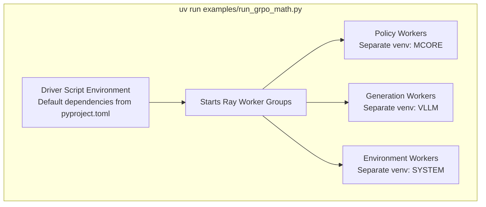
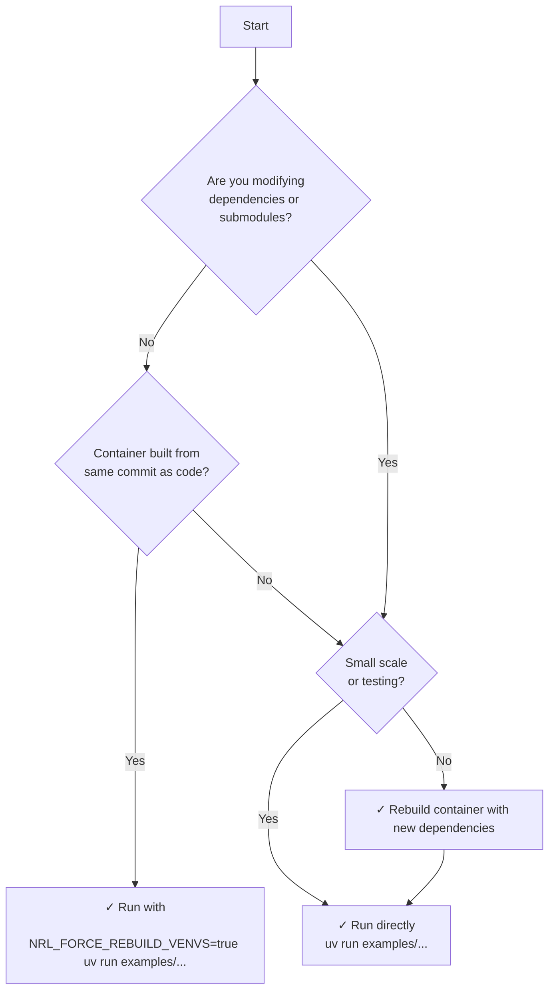

# Dependency Management

NeMo RL's dependency management system supports both production and development workflows through a flexible virtual environment architecture. This document explains how NeMo RL manages Python dependencies and when to use each workflow.

## Workflows Overview

NeMo RL supports two distinct workflows based on your use case:

### Production Workflow

A **production workflow** is when you run NeMo RL out-of-the-box (OOTB) without modifying dependencies. This is the typical scenario for:
- Running NeMo RL with pre-built Docker containers
- Using released versions without local modifications
- Executing examples with default dependencies

In a production workflow, the container's dependencies are aligned with your NeMo RL code version, and you can run applications directly without rebuilding environments.

> [!NOTE]
> This workflow is similar to how other machine learning projects work: the Docker image is static, and there's an assumption that the code works with the container's pre-installed dependencies. However, NeMo RL goes further by providing mechanisms to align container dependencies dynamically, offering more flexibility than traditional static containers.

### Development Workflow

A **development workflow** is when you actively modify dependencies, submodules, or work with code that has different dependency requirements than the container. Common scenarios include:

- **Version mismatch**: Using a container built from commit A, but your local NeMo RL code is at commit B, where B has different submodule versions or Python dependencies than A
- **Dependency changes**: Actively developing new features that require updated Python packages
- **Submodule modifications**: Working with modified versions of Megatron-LM, NeMo-Automodel, or other submodules

> [!WARNING]
> If your container was built from commit `abc123` which used `vllm==0.9.0`, but your local checkout is at commit `def456` which requires `vllm==0.10.0`, you are in a development workflow. The container's cached environments won't match your code's requirements.

## How `uv run` Works

When you execute a NeMo RL application, such as:

```bash
uv run examples/run_grpo_math.py
```

This command actually performs several steps behind the scenes:

```bash
uv lock + uv sync + source .venv/bin/activate + python examples/run_grpo_math.py
```

Let's break down each component:

### 1. `uv lock`

Resolves all dependencies specified in [`pyproject.toml`](https://github.com/NVIDIA-NeMo/RL/blob/main/pyproject.toml#L21-L54) and generates a lock file (`uv.lock`) that pins exact versions of all packages. This ensures reproducible builds across different environments.

### 2. `uv sync`

Synchronizes your local virtual environment with the locked dependencies. It installs or updates packages as needed to match the lock file.

The virtual environment location depends on your runtime environment:
- **Bare metal**: The venv defaults to `.venv/` local to your NeMo RL clone
- **Container**: The container sets [`UV_PROJECT_ENVIRONMENT=/opt/nemo_rl_venv`](https://github.com/NVIDIA-NeMo/RL/blob/main/docker/Dockerfile#L67), so the environment is synced to `/opt/nemo_rl_venv`. Note that this location is ephemeral to the container instance.

### 3. `source .venv/bin/activate`

Activates the virtual environment, setting up the Python path and environment variables so your script runs with the correct dependencies.

### 4. `python examples/run_grpo_math.py`

Executes your driver script within the activated environment.

## Multi-Environment Architecture



The driver script (`examples/run_grpo_math.py`) runs with the [default dependencies specified in `pyproject.toml`](https://github.com/NVIDIA-NeMo/RL/blob/main/pyproject.toml#L21-L54) (without optional extras like `mcore` or `vllm`). However, the application creates multiple worker groups, each potentially requiring different Python environments.

### Worker Groups and Virtual Environments

Within the driver script, NeMo RL starts multiple [`RayWorkerGroup`](https://github.com/NVIDIA-NeMo/RL/blob/main/nemo_rl/distributed/worker_groups.py#L303-L313) instances. Each worker group manages a set of Ray actors that execute tasks in parallel. These workers may have specialized dependency requirements:

- **Policy workers** (e.g., using Megatron-Core): Require `mcore` dependencies
- **Generation workers** (e.g., vLLM): Require `vllm` dependencies  
- **Environment workers** (e.g., math evaluation): Use system/base dependencies

Each worker type is mapped to a specific Python executable configuration in the [`ACTOR_ENVIRONMENT_REGISTRY`](https://github.com/NVIDIA-NeMo/RL/blob/main/nemo_rl/distributed/ray_actor_environment_registry.py#L27-L46). This registry defines which virtual environment should be used for each actor type:

```python
ACTOR_ENVIRONMENT_REGISTRY: dict[str, str] = {
    "nemo_rl.models.generation.vllm.vllm_worker.VllmGenerationWorker": VLLM_EXECUTABLE,
    "nemo_rl.models.policy.megatron_policy_worker.MegatronPolicyWorker": MCORE_EXECUTABLE,
    "nemo_rl.environments.math_environment.MathEnvironment": PY_EXECUTABLES.SYSTEM,
    # ... more mappings
}
```

> [!NOTE]
> For more details on how workers define and use their Python executables, see the [UV Documentation](uv.md#worker-configuration).

## Container Pre-caching

When a [release container](../docker.md#release-image) is built, it pre-caches:

1. **Virtual environments**: All worker virtual environments are created and stored in the container
2. **UV cache**: Python packages are pre-downloaded into the UV cache directory

This pre-caching significantly speeds up application startup in production workflows, as workers can immediately use their required environments without downloading or compiling packages.

### When Pre-cached Environments Are Sufficient

If your local NeMo RL checkout has the **same** Python dependencies and submodules as the container was built with, the pre-cached environments work seamlessly. You can simply run:

```bash
uv run examples/run_grpo_math.py
```

The workers will use the pre-cached virtual environments, and your application starts quickly.

## Handling Dependency Changes

When your local code has **different** dependencies than the container (development workflow), you have two options:

### Option 1: Force Rebuild Environments

Set the `NRL_FORCE_REBUILD_VENVS` environment variable to rebuild all worker virtual environments on every node:

```bash
export NRL_FORCE_REBUILD_VENVS=true
uv run examples/run_grpo_math.py
```

This approach works on both single-node and multi-node setups. On multi-node runs, each node will independently rebuild its virtual environments.

> [!TIP]
> This approach is convenient for local development and small-scale experiments. It automatically rebuilds environments to match your current dependency specifications without requiring a container rebuild.

> [!WARNING]
> On large-scale distributed runs (e.g., >=32 nodes), rebuilding environments on all ranks can add significant overhead. Consider rebuilding the container for these large runs

### Option 2: Rebuild the Container

For production deployments or large-scale runs, rebuild the container to pre-cache the new dependencies:

```bash
docker buildx build --target release -f docker/Dockerfile --tag my-registry/nemo-rl:custom .
```

> [!TIP]
> Rebuilding the container is recommended when:
> - Running a job with many nodes (>=32 nodes)
> - Dependencies have changed significantly
> - You need reproducible, fast startup times
> - Multiple team members need the same environment

The rebuilt container will have all virtual environments pre-cached with your updated dependencies, eliminating runtime overhead.

### Option 3: Classic Workflow - Mounting Modified Submodules

For situations where you're **only changing submodules** (like nemo-automodel, Penguin, Megatron-LM, or Megatron-Bridge) but **not changing Python package versions**, you can use a classic mounting approach. This workflow assumes that the non-submodule Python packages in your local checkout match what the container was built with.

The container's NeMo RL code is located at `/opt/nemo-rl`. By mounting your local `3rdparty/` directory over the container's `/opt/nemo-rl/3rdparty/`, you can swap out submodules without rebuilding environments or containers.

**Example - Mounting Modified Submodules on Slurm:**

Assuming you're launching from the root of your local NeMo RL clone:

```bash
# Run from the root of NeMo RL repo

CONTAINER=YOUR_CONTAINER \
MOUNTS="$PWD:$PWD,$PWD/3rdparty:/opt/nemo-rl/3rdparty" \
sbatch \
    --nodes=1 \
    --account=YOUR_ACCOUNT \
    --job-name=YOUR_JOBNAME \
    --partition=YOUR_PARTITION \
    --time=1:0:0 \
    ray.sub
```

This mounts:
1. `$PWD:$PWD` - Your local NeMo RL directory to the same path in the container
2. `$PWD/3rdparty:/opt/nemo-rl/3rdparty` - Your local submodules override the container's submodules at `/opt/nemo-rl/3rdparty`

> [!NOTE]
> This approach works because Python packages are already installed in the cached virtual environments. You're only swapping out the source code in the `3rdparty/` submodules, which doesn't require reinstalling packages or rebuilding environments.

> [!IMPORTANT]
> This workflow is **only suitable when**:
> - Python package versions in `pyproject.toml` and `uv.lock` haven't changed
> - You're only modifying code within submodules (nemo-automodel, Penguin, Megatron-LM, Megatron-Bridge)
> - The submodule commits/branches are compatible with the installed package versions

If you've changed Python package versions or dependencies outside of submodules, use Option 1 (`NRL_FORCE_REBUILD_VENVS=true`) or Option 2 (rebuild the container) instead.

## Decision Guide

Use this flowchart to determine which workflow applies to you:



## Frozen Environments

For users who prefer or do not need to use `uv` at runtime, NeMo RL containers provide "frozen" environments. In these environments, Python executables—each corresponding to an actor's `PY_EXECUTABLE`—are prebuilt with all required dependencies and made available directly in your `PATH`.

### What Are Frozen Environments?

In a frozen environment setup:
- `pip` is available in all virtual environments
- Python executables like `python-MegatronPolicyWorker` are accessible directly
- Users can manually install packages with `python-MegatronPolicyWorker -m pip install <pkg_name>`

> [!WARNING]
> While `pip` installing packages into a frozen environment is possible for experimentation or local debugging, **all dependencies must ultimately be added to `pyproject.toml` and locked in `uv.lock` before any change is upstreamed**. Direct `pip` installs are not reproducible or supported for collaborative or production workflows. **We cannot accept package additions that only exist via manual pip installs.**

### When to Use Frozen Environments

Frozen environments are useful when:
- You prefer traditional Python virtual environment workflows
- You want to manually manage package installations with `pip`
- You do not need `uv run` at runtime to automatically check if your dependencies are in sync

> [!NOTE]
> For most users, `uv run` is still the recommended approach as it ensures reproducible builds and automatic dependency management. Frozen environments require manual intervention to keep dependencies in sync.

### Available Python Executables

Containers provide convenience symlinks for each worker type:

```bash
# List all available python executables
ls /usr/local/bin/python-*

# Examples:
python                         # Default executable for driver scripts (e.g., examples/run_grpo_math.py)
python-MegatronPolicyWorker    # For Megatron policy workers
python-VllmGenerationWorker    # For vLLM generation workers
python-MathEnvironment         # For environment workers
```

> [!NOTE]
> The `python` executable (without any suffix) corresponds to the default frozen environment used to launch driver scripts like `examples/run_grpo_math.py`. This environment contains the base dependencies from `pyproject.toml` without optional extras.

To see which packages can be mounted for each executable:

```bash
python tools/list_editable_packages.py
```

### Container Version Checking

NeMo RL containers enforce environment reproducibility by automatically checking that your code and dependencies match the state of the container at build time. The version checking mechanism works by comparing:

- The **md5sum of `pyproject.toml`**
- The **md5sum of `uv.lock`**
- The **commit hashes of relevant submodules**

If any of these values differ between your code and the container image, NeMo RL will alert you and show exactly what has changed:

```text
--------------------------------------------------------------------------------
WARNING: Container/Code Version Mismatch Detected!

--------------------------------------------------------------------------------
Your container's dependencies do not match your current code.

Differences found:
  - pyproject.toml:
      Container: abc123def456
      Current:   xyz789abc012
  - uv.lock:
      Container: 0987f6543210
      Current:   1234abcd5678
  - submodules/3rdparty/ExampleSubmodule:
      Container: a1b2c3d4e5f6
      Current:   f6e5d4c3b2a1

This can lead to unexpected behavior or errors.

Solutions:
  1. Rebuild the container to match your code
  2. Set NRL_FORCE_REBUILD_VENVS=true to rebuild virtual environments
     (This forces Ray workers to recreate their venvs with updated dependencies)
  3. Set NRL_IGNORE_VERSION_MISMATCH=1 to bypass this check (not recommended)

Learn more about dependency management:
  https://github.com/NVIDIA-NeMo/RL/blob/main/docs/design-docs/dependency-management.md

--------------------------------------------------------------------------------
```

This check **only runs in containers** (when `NRL_CONTAINER=1` is set) and can be bypassed if absolutely needed:

```bash
export NRL_IGNORE_VERSION_MISMATCH=1
```

> [!WARNING]
> Bypassing version checks can result in subtle, hard-to-debug errors due to dependency mismatches. Only do this if you fully understand the risks and have a specific need.

> [!CAUTION]
> **If you modify a frozen environment manually** (for example, by running `python-MegatronPolicyWorker -m pip install <pkg_name>`) this change will *not* be detected or tracked by the container version check described above. This is strongly discouraged as it leads to a non-reproducible setup, increases the chance of hard-to-debug environment errors, and breaks the guarantee of consistency across developer machines and production deployments. 
>
> Always make dependency changes in `pyproject.toml` and use the recommended workflows so that your environment stays consistent and traceable.

## Summary

NeMo RL's dependency management balances flexibility and performance:

- **Production workflows** leverage pre-cached environments for fast, reliable startup
- **Development workflows** can dynamically rebuild environments as needed (this works on multi-node setups as well)
- **Submodule-only changes** can use the classic mount workflow to swap submodules without rebuilding environments
- **Container rebuilds** provide the best performance for large-scale production runs
- **`NRL_FORCE_REBUILD_VENVS`** offers flexibility for development without container rebuilds
- **Frozen environments** provide an alternative to `uv run` for users who prefer traditional Python virtual environment workflows with direct access to specialized Python executables

Choose the approach that best fits your scale and development velocity:
- For most users, the **production workflow** with pre-built containers provides the optimal experience
- When iterating on submodule code, the **classic mount workflow** offers a fast middle ground
- For significant dependency changes, use **`NRL_FORCE_REBUILD_VENVS`** for small runs or **rebuild containers** for large-scale deployments
- For manual dependency management, **frozen environments** are available, though `uv run` is recommended for reproducibility

